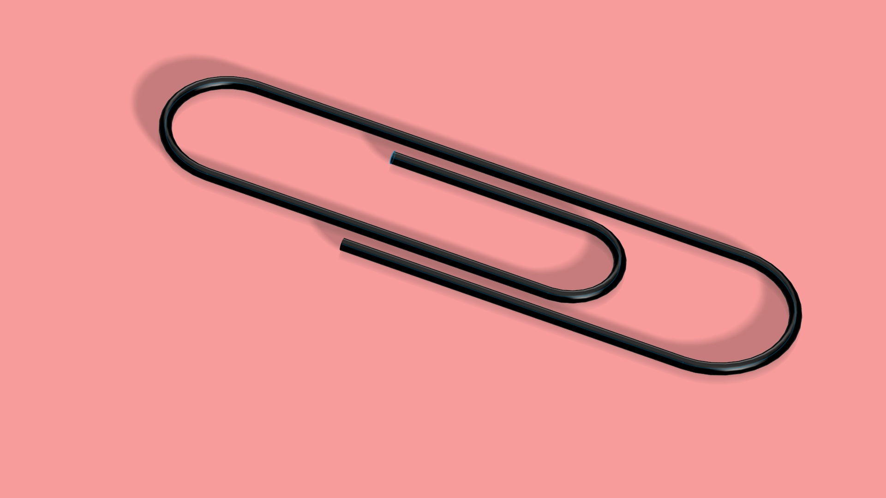

# 3D-Printed Paperclip

Design a paperclip that holds 10 A4 sheets, prints in under 3 hours,
and is safe for anyone over 12.

## Approach
Seven of us each modelled a different clip in SolidWorks, printed
them in PLA, and tested them. Five of the seven failed for
manufacturability reasons rather than design ones — gaps below the
printer's resolution fused solid, and thin sections were too brittle
to flex without snapping.

The final design (mine) took the geometry of the traditional clip
and tuned wall thickness and gap spacing to the printer's limits:
flexible enough to open, thick enough to survive the print.
Combined print time for the final two parts: 2h50m.

## Files
- `cad/` — SolidWorks parts
- `stl/` — print-ready meshes
- `report.pdf` — full report incl. prototype test results

## Takeaways
- Design for the process, not just the part. Every failure here was a
  printer-resolution problem the CAD model gave no warning about.
- Prototype early and in parallel — seven cheap prints found the
  constraint faster than any amount of modelling would have.

---
EE194 Project-Based Learning, Maynooth University, Semester 1, Year 1 (Nov 2023).
Group of 7 — my contribution: final production design, presentation
slides, and prototype print prep.
